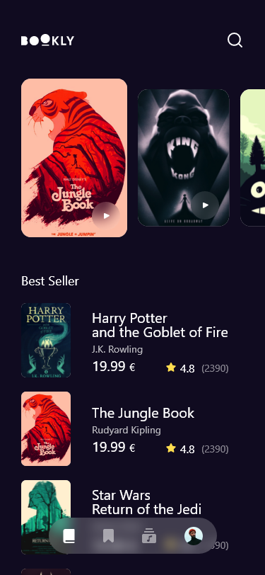
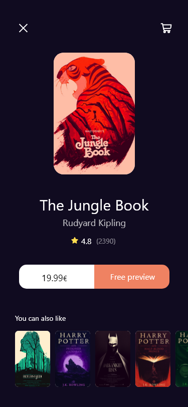

# Bookstore Concept App

Welcome to the Bookstore Concept App, an innovative Flutter project dedicated to offering a seamless and captivating experience for exploring books sourced from the Google Books API. This project embraces a dark theme to provide an immersive reading environment and implements robust Flutter architecture following MVVM design principles.

## Screenshots

### Dark Theme

<<<<<<< HEAD
     
  

=======
    <>
   
>>>>>>> 6baa2f640e4b10449e4fcbbf4afb7381fef7ac62
 

## Project Overview

### Features

- **Book Exploration:** Seamlessly browse a vast collection of books sourced from the Google Books API.
- **Dark Theme:** Immerse yourself in an optimal reading environment with the exclusively designed dark theme.
- **Book Details:** Access detailed information about each book, including synopsis, author details, and reviews.
- **Book Preview:** Preview select pages of a book to get a glimpse before making a choice.

### Tech Stack

- **Flutter:** Harness the power of Flutter for cross-platform mobile development, ensuring a smooth and consistent experience.
- **MVVM Architecture:** Implement the Model-View-ViewModel design pattern for a scalable, organized, and easily maintainable codebase.
- **State Management:** Utilize efficient state management techniques for handling application state in a streamlined manner.
- **Google Books API Integration:** Seamlessly integrate and retrieve book data from the Google Books API using efficient network requests.
- **SOLID Principles:** Adhere to SOLID principles to ensure a robust and maintainable software architecture.
